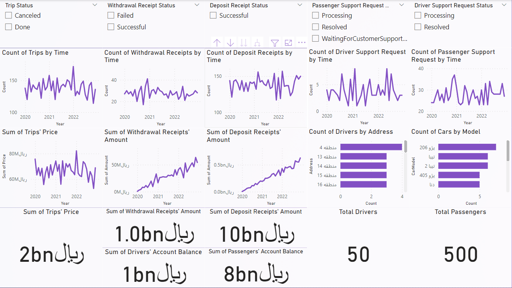

# Online Taxi Service Database and Management Dashboard

This repository contains my coursework for the "Management Information Systems"
course at AUT (Tehran Polytechnic).

## Project Description

For the final project of this course, we decided to work on a dashboard for an
online taxi service. First, we had drew an ERD in MS Visio and created a
database in SSMS according to it. Then, we populated the database with data
generated in MS Excel. Finally, we designed a dashboard in Power BI to gain
insight into the performance of the service.

## ERD

## Dashboard

